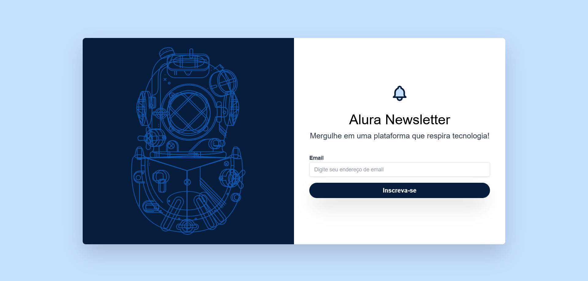

## 📸Imagem do projeto

  

## 🖥️Sobre o projeto
Esse é um projeto Web Responsivo de uma página de notícias Tech, desenvolvido com base em um modelo no Figma para aprimorar as habilidades em Tailwind CSS.

## 🚀Tecnologias utilizadas
Esse projeto foi desenvolvido durante o curso de HTML e CSS da Alura com as seguintes tecnologias: 
-HTML 
-CSS 
-Git e GitHub 
-Figma 
-Tailwind CSS